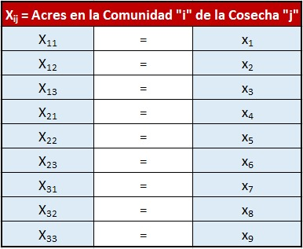
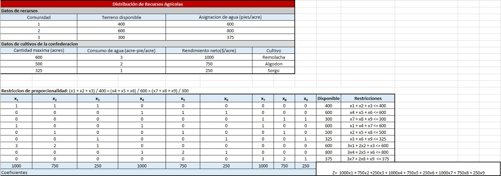
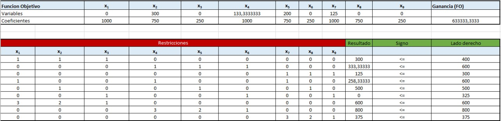
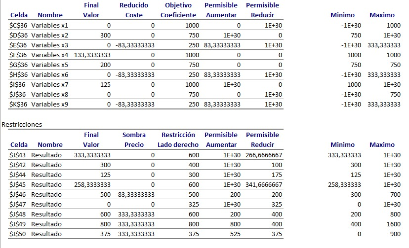

```{r setup, include=FALSE}
knitr::opts_chunk$set(echo = TRUE)
```

# Estudiantes
Randald Villegas Brenes  
Kevin Andrés Solano Jiménez

## Librerias
Librería utilizada en el examen.
```{r, warning=FALSE}
library (lpSolve)
```


# Problema #1

## Tabla Resumen

|            |$x_1$|$x_2$|$x_3$|$x_4$|      Disponible    |    Restricciones |
|:----------:|:---:|:---:|:---:|:---:|--------------------|:-----------------|
|Fondo 1     |1    |2    |3    |4    |$x_1\leq 4$         |                  |
|Fondo 2     |1    |2    |3    |4    |$2x_2 \leq 12$      |                  |
|Fondo 3     |1    |2    |3    |4    |$3x_1+2x_2 \leq 18$ |                  |
|Fondo 4     |1    |2    |3    |4    |                    |                  |
|Ganancia    |1    |2    |3    |4    | $Z=3x_1+5x_2$      |                  |


**Modelo:**

|         |     |        
|:------- |:---|
|FO:      |$Z=0.05x_1+0.06x_2+0.04x_3+0.09x4$|
|Sujeto a:$\hspace{1cm}$|$x_1-3x_3-3x_4<= 0$|
|         |$x_2<= 42500$|
|         |$x_4-x_2<=0$|
|         |$x_1+x_2+x_3+x_4<= 125.000$|
## Solución Original
```{r}
# Definición de los coeficientes
coef.obj <- c(0.05, 0.06, 0.04, 0.09)

# Definición de las restricciones
coef.restr <- matrix(c(1, 0, -3, -3, 0, 1, 0, 0, 0, -1, 0, 1, 1, 1, 1, 1), nrow = 4, byrow = T)
dir.rest <- c("<=", "<=", "<=", "<=")
param.rest <- c(0, 42500, 0, 125000)

#Solución del problema
solucion <- lp("max", coef.obj, coef.restr, dir.rest, param.rest, compute.sens = T)
```
##### Monto Máximo de rendimiento
```{r}
solucion$objval

# El monto máximo es de $8.375
```
##### Distribución de los $125.000
```{r}
solucion$solution

# x_1 (Fondo 5%) = $40.000
# x_2 (Fondo 6%) = $42.500
# x_3 (Fondo 4%) = $0
# x_4 (Fondo 9%) = $42.500
```

### Punto 4
En este caso los valores o coeficientes de las FO hacen referencias a los diferentes porcentajes de inverción que se desea realizar en los 4 fondos
con respecto a los valores mínimos o máximos de los coeficientes de la función objetivo, sería los siguientes:

**Coeficiente 1:** Valor Original: 0.05 ------ Valor Mínimo: 0.04         ------ Valor Máximo: 0.075  
**Coeficiente 2:** Valor Original: 0.06 ------ Valor Mínimo: 0.01         ------ Valor Máximo: Infinito  
**Coeficiente 3:** Valor Original: 0.04 ------ Valor Mínimo: 0.04 - 1E+30 ------ Valor Máximo: 0.05   
**Coeficiente 4:** Valor Original: 0.09 ------ Valor Mínimo: 0.05 ------ Valor Máximo: Infinito

### Punto 5
Dentro de las recomendaciones que le daríamos al inversioniste, sería que a las inversion del 5%, la aumente a un 7.5% y las inversiones del 6% y 9%, las lleve al 100% para así obtener una mayor ganancia, esta recomendacion representaria un gran aumento en las ganacias desde **\$8.375** como valor de ganancias gasta **\$88.000**

### Punto 6
Considerando los precios sombra, se recomienda eliminar el valor derecho 0 de la tercera restricción (x_4 - x_2 < 0) y aumentarlo a lo maximo posible que serían **\$40.000**, todo esto con base a los valores sombra

## Solución Sugerida por analistas una vez aplicado lo dicho en el Punto 5 y 6
```{r}

# Definición de los coeficientes
coef.obj <- c(0.075, 1, 0.00, 1)

# Definición de las restricciones
coef.restr <- matrix(c(1, 0, -3, -3, 0, 1, 0, 0, 0, -1, 0, 1, 1, 1, 1, 1), nrow = 4, byrow = T)
dir.rest <- c("<=", "<=", "<=", "<=")
param.rest <- c(0, 42500, 40000, 125000)

#Solución del problema
solucion1 <- lp("max", coef.obj, coef.restr, dir.rest, param.rest, compute.sens = T)
```
##### Monto Máximo de rendimiento
```{r}
solucion1$objval

# El monto máximo es de $125.000
```
##### Distribución de los $125.000
```{r}
solucion1$solution

# x_1 (Fondo 5%) = $0
# x_2 (Fondo 6%) = $42.500
# x_3 (Fondo 4%) = $0
# x_4 (Fondo 9%) = $82.500
```


# Problema #2


## Tabla de resumen

#### La siguiente tabla se utilizo para representar la combinacion de variables de las comunidades y las cosechas, con el proposito de representar de una manera mas legible el problema con la herramienta de solver:



#### Despues de plantear las combinacion de las variables, se procede a organizar los datos que brinda el problema:




## Modelo de programación lineal

- Función Objetivo: **(Maximizar)** Z = 1000(x1 + x4 +x7) + 750(x2 + x5 + x8) + 250(x3 + x6 + x9)

- Z=  1000x1 + 750x2 +250x3 + 1000x4 + 750x5 + 250x6 + 1000x7 + 750x8 + 250x9


### Restricciones:

#### Primero se delimita la cantidad de terreno disponible para cada una de las comunidades:

- **x1 + x2 + x3 <= 400**
- **x4 + x5 + x6 <= 600**
- **x7 + x8 + x9 <= 300**

#### Luego se delimita la cantidad de terreno disponible para cada una de las cosechas disponibles:

- **x1 + x4 + x7 <= 600**
- **x2 + x5 + x8 <= 500**
- **x3 + x6 + x9 <= 325**

#### Seguidamente se delimita la cantidad de agua disponible para cada una de las comunidades:

- **3x1 + 2x2 + x3 <= 600**
- **3x4 + 2x5 + x6 <= 800**
- **3x7 + 2x8 + x9  <= 375**

#### Finalmente se agregan 3 restricciones que aseguran que se cumpla que entre las tres comunidades se siembre la misma proporción de sus tierras:

- **(x1 + x2 + x3) / 400 = (x4 + x5 + x6) / 600 = (x7 + x8 + x9) / 300**


## Problema planteado para resolverlo con Solver




#### La solucion optima que brinda Solver es:

- **x1 = 0**
- **x2 = 300**
- **x3 = 0**
- **x4 = 133,3333333**
- **x5 = 200**
- **x6 = 0**
- **x7 = 125**
- **x8 = 0**
- **x9 = 0**


#### Con los datos que brinda solver, se puede interpretar que en la comunidad 1, se sembraran 300 acres de algodon, en la comunidad 2, se sembraran 133.3333333 de remolachas, 200 de algodon y en la comunidad 3 se sembraran 123 remolachas.

#### Con la función objetivo con un valor de **63333,3333**


## Entre los componentes de restricción (terreno, agua, cultivo, proporcionalidad) si hubiese posibilidad de modificar las restricciones, se determina que los que puede incidir más en la variación del rendimiento total son:

- **El agua**
- **El cultivo**

#### Debido a que como se menciona al inicio, el principal problema es el agua y eso implica que no se pueda sembrar muchos cultivos, lo que los hace incidir mas en el rendimiento total. 


## Si la confederación consultara sobre la posibilidad de aumentar el rendimiento total, pero partiendo del hecho de que NO es posible aumentar la disponibilidad de agua para cultivo, ¿qué le recomiendarían modificar y cuál sería el efecto en el rendimiento?

- **x5**
- **x7**
- **x8**
- **x9**

#### Debido a que segun el precio sombra que muestra en el analisis de sencibilidad se ve reflejado el incremento que se puede generar si se mantiene el los limites de los permisibles:




## ¿Cuál sería el rendimiento máximo esperado?.
